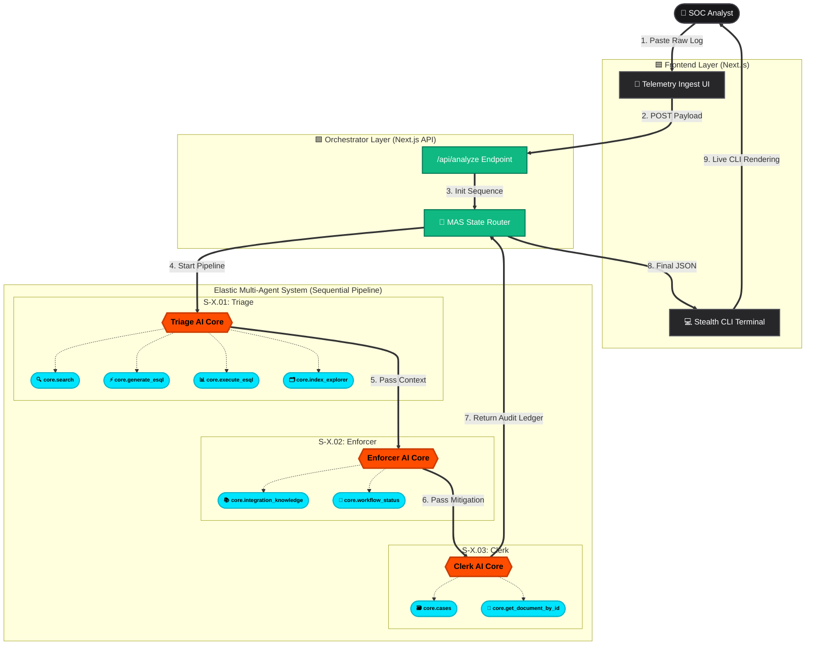

# SentinelX-SOC-Copilot
### Autonomous Multi-Agent Security Operations Platform
SentinelX is an autonomous SOC Copilot . It investigates security incidents, classifies risk, and enforces real-time remediation actions like account lockdown, token revocation, and audit logging
 sample logs 

---


## Project Demo


[](https://youtu.be/nqu9Xf41ekM)

> **live demo orchestration : https://sentinel-x-soc-copilot.vercel.app/**
---

## The Problem

Modern Security Operations Centers (SOCs) are overwhelmed by **alert fatigue**. Every day, analysts receive thousands of low-to-medium severity alerts — SSH brute-force attempts, suspicious login spikes, anomalous IP scans.

Even for small incidents, analysts must:

- Parse raw telemetry logs
- Query historical authentication data
- Validate threat intelligence
- Create firewall remediation rules
- Document incidents for compliance (SOC2, NIST, etc.)

This repetitive workflow increases **Mean Time To Respond (MTTR)** and distracts teams from high-severity investigations.

> Sentinel-X is not designed to replace SOC teams. Instead, it reduces their workload by automatically detecting, enforcing, and documenting clearly defined, repetitive security threats.
>
> **We don't just detect threats — we enforce action and complete the compliance loop.**

---

## The Solution: A Multi-Agent System (MAS)

Sentinel-X is a **sequential, state-driven Multi-Agent System** built using Elastic Agent Builder and Elasticsearch.

Instead of one general AI model, we use **three specialized agents**. Each agent has a narrow, deterministic responsibility and specific Elastic tools. Agents pass structured JSON state to the next stage to ensure reliable multi-step execution.

---

## ➦ S-X.01 — Threat Triage Engine
**Role: The Data Hunter**

This agent ingests raw logs and performs contextual threat analysis using live Elasticsearch data.

**Tools Used:**

| Tool | Description |
|------|-------------|
| `platform.core.search` | Searches historical logs for known malicious IPs and anomaly patterns |
| `platform.core.generate_esql` | Dynamically generates ES\|QL queries from natural language instructions |
| `platform.core.execute_esql` | Executes ES\|QL queries to retrieve structured, tabular data |
| `platform.core.index_explorer` | Identifies relevant data streams such as `logs-network-*` or `logs-auth-*` |

**Functionality:**

S-X.01 extracts Indicators of Compromise (IoCs), maps behavior to MITRE ATT&CK techniques (e.g., `T1110`), calculates a confidence score, and produces a structured decision: **`BLOCK`** or **`MONITOR`**.

All decisions are validated against real Elasticsearch cluster data — not prompt-based assumptions.

---

## ➦ S-X.02 — Active Enforcer
**Role: The Muscle**

This agent transforms threat decisions into enforceable remediation actions.

**Tools Used:**

| Tool | Description |
|------|-------------|
| `platform.core.integration_knowledge` | Accesses Fleet integration docs for firewalls (Palo Alto, Fortinet, Cisco) to generate accurate JSON payloads |
| `platform.core.get_workflow_execution_status` | Simulates checking SOAR playbook execution status before proceeding |

**Functionality:**

When S-X.01 issues a `BLOCK` directive, S-X.02 generates a **Zero-Trust deny policy** and produces a validated firewall API execution log.

This enables automatic enforcement of repetitive, low-severity threats — eliminating the need for analysts to manually craft firewall rules.

---

## ➦ S-X.03 — Compliance & Audit Clerk
**Role: The Auditor**

Security enforcement is incomplete without compliance documentation.

**Tools Used:**

| Tool | Description |
|------|-------------|
| `platform.core.cases` | Interfaces with Elastic's native incident management system |
| `platform.core.get_document_by_id` | Retrieves the exact malicious Elasticsearch document for secure audit attachment |

**Functionality:**

S-X.03 maps the incident and remediation to **SOC2** and **NIST CSF** controls, generates a structured JSON audit ledger, and indexes it back into Elasticsearch.

This ensures every enforcement action is automatically documented and audit-ready.

---

## Technical Execution

Sentinel-X is built on **Elastic Cloud** and connects securely to a Kibana endpoint using API key authentication.

The orchestration layer:

1. Accepts raw telemetry input
2. Executes agents sequentially
3. Passes structured JSON state between agents
4. Uses Elastic tool calls with defined timeouts
5. Indexes final compliance records back into Elasticsearch

This architecture ensures **deterministic multi-step automation**, minimizes hallucination, and demonstrates real tool-driven execution — not simple prompt chaining.

---

## System Architecture



---

## 📂 Project Structure

```bash
SENTINELX-SOC-COPILOT/
├── 📂 frontend-soc/              # Next.js Frontend Application (React/Tailwind)
│   ├── 📂 app/                   # Next.js App Router
│   │   ├── 📂 api/analyze/       
│   │   │   └── 📜 route.ts       # Gateway: Orchestrates API calls to agents
│   │   ├── 📜 favicon.ico        
│   │   ├── 📜 globals.css        # Stealth SaaS theme & Tactical Grid CSS
│   │   ├── 📜 layout.tsx         # Root layout definitions
│   │   └── 📜 page.tsx           # Main Sentinel-X Enterprise Terminal UI
│   ├── 📂 components/            # Reusable UI Components
│   │   ├── 📜 AgentCard.tsx      # Multi-Agent status visualizer
│   │   ├── 📜 LogInput.tsx       # Telemetry ingestion component
│   │   └── 📜 StatusIndicator.tsx # Live system status LEDs
│   ├── 📂 lib/                   # Helper functions and utilities
│   ├── 📂 public/                # Static front-end assets
│   ├── 📜 .env.local             # Frontend API keys (Git ignored)
│   ├── 📜 next.config.ts         # Next.js build configuration
│   ├── 📜 package.json           # Node.js dependencies
│   ├── 📜 postcss.config.mjs     # CSS processing config
│   └── 📜 tsconfig.json          # TypeScript configuration
│
├── 📜 .env                       # Root environment variables
├── 📜 .gitignore                 # Git ignore rules
├── 📜 python.py                  # Python backend utility script
├── 📜 README.md                  # Main project documentation
├── 📜 requirements.txt           # Python backend dependencies
└── 📜 sentinel_brain.py          # Core Python AI processing & Agent logic
```

---

## Potential Impact 

Security teams spend significant time handling repetitive, low-to-medium severity incidents such as brute-force attempts and suspicious login spikes. Even minor events can take 15–30 minutes to investigate, enforce, and document properly.

Sentinel-X reduces this workflow to under 30 seconds for clearly defined threat patterns by automating detection, enforcement, and compliance logging in a single pipeline.

By automatically enforcing repetitive threats and generating audit-ready records, Sentinel-X:

- Reduces alert fatigue:
- Lowers Mean Time To Respond (MTTR)
- Improves consistency in remediation actions
- Minimizes manual compliance documentation effort

This allows SOC analysts to focus on complex, high-severity investigations instead of repetitive operational tasks.

Sentinel-X demonstrates how Elastic Agent Builder can power reliable, multi-step AI agents that perform real operational work — not just analysis, but enforcement and documentation.

---

## What We Liked & Challenges Faced

One of the most powerful aspects of Elastic Agent Builder was assigning clearly scoped tools to each agent. Using `generate_esql` and `execute_esql`, our agents reason over **real Elasticsearch data** instead of static prompts. The `integration_knowledge` tool enabled the Active Enforcer to generate accurate, documentation-grounded firewall payloads.

A key challenge was building **reliable multi-step orchestration**. Passing structured JSON state between agents was critical to prevent hallucination and ensure deterministic execution. We also carefully managed tool timeouts and formatting to maintain stable, end-to-end workflow behavior while keeping enforcement realistic and responsible.

---

## Getting Started (Local Execution)

If you wish to test the **Sentinel-X** frontend locally, follow these steps:

---

### Prerequisites

- Node.js 18+
- An active Elastic Cloud deployment with API access

---

### 1. Clone & Install
```bash
git clone https://github.com/your-username/SentinelX-SOC-Copilot.git
cd SentinelX-SOC-Copilot
npm install
```

---

### 2. Environment Setup

Create a `.env.local` file in the root directory and add your Elastic credentials:
```env
ELASTIC_API_KEY=your_api_key_here
ELASTIC_ENDPOINT=your_cluster_url_here
```

---

### 3. Run the Development Server
```bash
npm run dev
```

Navigate to [http://localhost:3000](http://localhost:3000) to access the **Enterprise Core Terminal**.

---

### 4. Test the Pipeline

Paste the following sample log into the `RAW_TELEMETRY_INGEST` console and click **"Initiate Threat Scan"**:
```
[25/Feb/2026:10:12:44 +0000] "SSH-2.0-OpenSSH_8.2p1" 401 0 "-" src_ip="198.51.100.42" msg="Failed password for root from 198.51.100.42 port 54332 ssh2" attempts=842 geo="RU"
```

> **Note:** IP `198.51.100.42` is used for safe, sanctioned demonstrations to comply with LLM security guardrails.

---

### 👤 Author

**Naveen Kumar**  
Student @ CIT — Aspiring Full Stack & AI Engineer  
Built for the **Elasticsearch Agent Builder Hackathon**.
